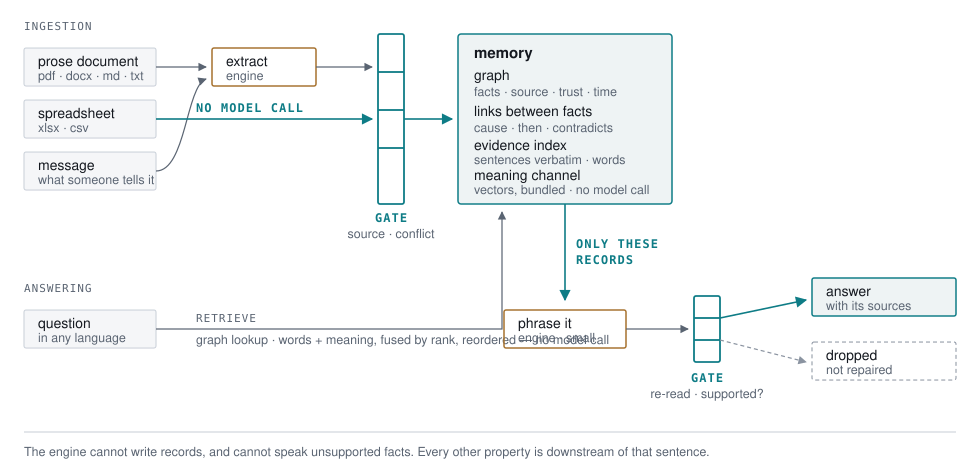

# LMM — Living Memory Model

**A verifiable memory layer for language models.** Facts live in a graph, every
claim carries its source, and an answer the memory does not support cannot leave
the system.

[](https://github.com/ruzgarkanar/Lmm/actions/workflows/ci.yml)
[](https://ruzgarkanar.github.io/Lmm/)
[](https://pypi.org/project/living-memory-model/)
[](LICENSE)
[](https://pypi.org/project/living-memory-model/)

📚 **[Documentation](https://ruzgarkanar.github.io/Lmm/)** — concepts, guides, the full API surface, and every measurement with its receipts.

📄 **[Scaling Memory Instead of Scaling Parameters](https://medium.com/@ruzgar.kanar/scaling-memory-instead-of-scaling-parameters-f70959142c33)** — why this exists, measured against GraphRAG, and the two bugs I found in my own scorer.

> In an LLM, knowledge is frozen into weights at training time.
> In LMM, knowledge lives in a memory you can write to, inspect and audit —
> which is what makes "I don't know" trustworthy rather than polite.

```bash
pip install living-memory-model      # the import is `lmm`
```

```python
from lmm import Memory

m = Memory("mind.lmm")            # persistent; Memory() is transient
m.learn("manual.pdf")             # pdf · docx · xlsx · csv · md · txt · or text
print(m.ask("what is the screen's diagonal?"))
m.save()
```

That is the whole API. One method reads every format, and the file extension
picks the adapter.

---

## How it works

<picture>
  <source media="(prefers-color-scheme: dark)" srcset="docs/architecture-dark.svg">
  
</picture>

The gate is drawn twice on purpose. On the way in it decides what may become a
record; on the way out it re-reads the sentence the engine produced and drops
any claim the memory does not support. Everything else in this README —
the abstention rate, the audit trail, the cost — follows from those two edges.

Two details worth naming. A spreadsheet reaches the graph with **no model call
at all**, because a table already states its own structure; that is why a sheet
loads in milliseconds. And the engine is drawn smaller than the memory because
it is smaller: it phrases, it does not know.


### Two channels, both local, both explainable

Retrieval reads the same store two ways, and both can say why a line
arrived:

| channel | what it reads | the statistic |
|---|---|---|
| **lexical** | the words a line carries | information content: `log(1+N/df)`, and `log(S/s)` for a word's power to separate documents |
| **structural** | records, fields, and the entities a document repeats | a field is a head the corpus repeats; an entity is a phrase whose words occur together beyond chance (PMI), keep varied company, and do not choose freely |

None of them calls a model, none of them needs a vendor, and none of them
widens what may be SAID: they widen what can be FOUND, and the gate reads
the evidence exactly as before.

The entity channel is also the partition. Measured on a 36,472-line
novel: asked what connects two entities, the lexical search finds a line
carrying both — six pairs out of six — and takes **417 ms** doing it,
because every line carrying either name is scored. The same lines come
out of two posting lists in **0.01 ms**. Not a better reading; the same
reading without reading the document.

---

## The composer: a plan is a proposal, the primitives are the law

A memory that answers only the question shapes somebody wired by hand
answers a finite set of questions, and shapes are endless. So the shapes
are composed rather than coded:

```
question ──► the engine proposes a PLAN over verified primitives
             a = anchor: the recital        (its dated line, read from the
             b = anchor: the gala            sentence before the envelope)
             out = span: a, b               (arithmetic, ours)
                    │
                    ▼
             the interpreter executes ONLY operations it knows, on phrases
             the STORE can anchor — an unknown operation, an unanchorable
             phrase, a dangling reference: the plan dies, no claim is born
                    │
                    ▼
             the sentence is built from the final step's TYPED value by our
             template; the engine contributes operation names and phrases,
             never an output word
```

The primitives are the measured organs: anchor a phrase to its dated line,
take the latest, gather lines, span two dates, order them, filter by a
cutoff, count, tally by month. Measured on a dated store, five question
shapes nobody wrote an organ for — *did A happen before B*, *in which month
most*, *how many days between*, *when first*, *when last* — answered
correctly with no new code.

And the seat binds the plan's output TYPE: a count-shaped turn will not
voice a month tally, however correct that tally's arithmetic. Organs
silent and plan dead, the turn refuses rather than gambles the prose
chain — measured on a benchmark slice where the chain earned two right
answers and twenty-three wrong ones.

### Dialogue is data with two more columns

Chat is trickle data: events melt into talk, and two things every
conversation carries were being flattened into prose.

**When it happened** is the sentence's word before the envelope's. People
tell events days later — *[stamped April 10] back on March 22 the GPS
died* — so the engine reads the candidate lines and proposes the date; the
arithmetic decides whether the reading may stand (the date must equal some
candidate's stamp, or its day must be written as a number in that line
with the year in the stamp's neighbourhood). An invented date fails both
and the envelope speaks, as before. No month table, no date grammar.

**Who spoke** is metadata as real as the date. `learn(..., speaker=)` keeps
it per line, `session.asker` says who is asking, and the event organs seat
that speaker's lines first — nothing excluded, priority alone moves.

**`m.distil(text)`** is the write-time reading for passages where events
melt into talk: the engine LISTS each event as thing/what-happened, the
passage's own words admit it, and each survivor becomes one gated dated
record — while the passage is kept as evidence, so nothing is lost.
Documents that state their own structure need none of it; their rows reach
the graph for free.

---

## Why not embedding RAG

|  | Embedding RAG | LMM |
|---|---|---|
| Ingestion | chunks + embeddings | facts into a **graph** + sentences into an **evidence index** |
| Retrieval | similarity gamble | deterministic word/graph lookup, explainable |
| Multi-hop | fails when chunks don't co-retrieve | **derives** new facts symbolically (µs, no model call) |
| Paraphrase | the embedding's strength | **the open gap** — a bridge learned per field, and the engine's second ask; a dense channel is the instrument this wants and is not built yet |
| Entity graph | built by an LLM (GraphRAG), a claim | built by the document: an entity is a **collocation**, an edge is a **witnessed co-mention** carrying its sentence |
| Fabrication | a plea in the prompt | **structural gate**: unsupported claims cannot leave |
| Provenance | none | every fact carries its source; uncertain answers are flagged |
| Tables | flattened into text | **rows go straight into the graph** — zero model calls |
| A 350-page manual | seconds of embedding, lossy retrieval | queryable in **~2 s** |

The core install has **no dependencies at all**. The graph, the gate, the trust
ordering and the derivation are pure python — no model, no network, no GPU.

## Measured

Same questions to both sides. RAG baseline: LangChain + multilingual embeddings
+ Chroma + gpt-4o-mini, best-practice grounding prompt. **LMM's engine here is
the same gpt-4o-mini**, so the column compares architectures, not model sizes.
LMM figures are medians of three samples — these benchmarks are noisy and a
single run is not a measurement.

| Benchmark | RAG | LMM |
|---|---|---|
| Fictional corpus, 17 q (no parametric leakage possible) | 14/17 | **17/17** |
| A strategy document, 16 q | 13/16 | **14/16** |
| A 350-page device manual, 30 q | 14/30 | **27/30** — ingested in **2.3 s** vs 9.2 s |
| An inspection spreadsheet, 15 q | 15/15 | 14/15 — ingested in **86 ms** vs 4.7 s |
| **Wrong facts asserted, all runs** | 1 | **0** |

The bigger the document, the wider the gap: retrieval collapse is RAG's
structural ceiling, composition is LMM's structural strength.

### Four corpora, one code path

The table above is one document at a time. These are the sets the answer
path is developed against — three runs each, medians, same engine:

| Corpus | factual | comparisons | frontier* | traps (fabrication) |
|---|---|---|---|---|
| 62 sibling training outlines, 73 q (customer's, not redistributable) | **40/40** | **15/15** | 7/8 | **10/10** |
| 12 hardware specifications, 19 q — a corpus the system had never seen, no adaptation | **8/8** | **4/4** | **3/3** | **4/4** |
| 1,000 generated specifications, 50 q (questions derived from the corpus, not written by hand) | **25/25** | — | — | **25/25** |
| NIST SP 800-63B (public PDF), 13 q · fictional EN corpus, 17 q | 11/13 · 17/17 | — | — | — |

Every category above is a median of three runs with **zero flips** — no
question changed its verdict between runs — except the single frontier
miss.

\* *frontier*: questions whose discriminating word the documents never
write ("the priciest" against a column headed LIST PRICE).

### Against three memory frameworks, same corpus, same engine

LangChain (RAG), LlamaIndex and Mem0 answering the same questions over
the same 62 documents, each with Azure `gpt-4o-mini` behind it, two
repeats:

| | factual | comparisons | frontier | traps | wrong facts asserted | p50 latency | ingestion |
|---|---|---|---|---|---|---|---|
| LangChain | 21/40 | 14/15 | 4/8 | 9/10 | 1 | **1.9 s** | 75.6 s |
| LlamaIndex | 29/40 | 13/15 | 6/8 | 9/10 | 1 | 3.4 s | 12.9 s |
| Mem0 | 25/40 | 15/15 | 5/8 | 8/10 | 2 | 2.2 s | 161 s |
| **LMM** | **40/40** | **15/15** | **7/8** | **10/10** | **0** | 5.9 s | **2.1 s** |

The shape of that table is the design: LMM is ahead on every accuracy
column and alone at zero fabrications, loads a corpus in seconds rather
than minutes, and pays for its verification in per-question latency —
three model calls to answer, three more to audit the answer, where a RAG
pipeline makes one and asserts whatever comes back. The questions it can
answer from a record cost nothing at all (0.01 s), which is what pulled
the median down from 11.2 s.

**Speed.** A question that names a document and one of the corpus's own
field heads is answered from the record itself — no model call, no
composition, the document's line and its stamp: **0.01 s** where the same
question used to take 10.4 s and twelve calls. It fires on 33 of the 40
factual questions above and on none of the comparisons, frontier
questions or traps, which is the shape it should have. Questions that
need the engine still cost what verification costs: 8 s for a comparison,
7 for an honest refusal.

**Scale, measured on the 1,000-document store (25k sentences):** ingestion
2.2 s, 82 MB resident, retrieval 121 ms median with the named document's
line recalled 50/50. **Conversation depth:** the same twelve questions
scored 11/12 asked to a fresh session and 11/12 asked after twenty-four
turns of other documents, pointers and topic switches — the same single
failure in both.


Only the invented corpus is in this repository. The other three documents belong
to their owners — a manufacturer's product manual, an institution's internal
strategy document, an inspection report naming real people — and are not ours to
redistribute. `benchmarks/corpus*.txt` is a fictional world written so that no
answer can come from what a model already knows.

**These numbers are lower than this file used to show, and that is the point.**
An audit removed everything that had been fitted to the documents being scored:
few-shot examples quoting the manual's own voltages, a prompt clause teaching the
exact distinction one question turned on, and thresholds (a 700-character
window, a 40-character cell, a 0.75 similarity) chosen while reading one PDF.
The honest cost was **62/63 → 59/63**, of which the prompt content alone was 4
points — that was the share of the score that came from having seen the test.
Removing the last Turkish from the runtime cost one point more.

## Against GraphRAG, measured

Beating chunk-and-embed is the obvious comparison. The one that matters is
against graph-structured memory, so this runs **Microsoft's own package** —
`pip install graphrag`, its indexer, its prompts, its defaults, local search —
on the same corpora, with the same engine, scored by the same side-blind
evaluator. Nothing is reimplemented, so nothing here is a strawman.
[`benchmarks/graphrag_side.py`](benchmarks/graphrag_side.py).

| Same engine (gpt-4o-mini), 3 samples each | LMM | GraphRAG |
|---|---|---|
| Fictional corpus (1.6 KB), 17 q | **17/17** · spread 0 | 16/17 · spread 0 |
| NIST SP 800-63B (45k tokens), 13 q | **11/13** · spread 0 | 7/13 · spread **2** |

**The small corpus nearly saturates both. The real standard separates them**,
and the shape of the losses matters more than the totals.

*GraphRAG loses specific values.* Three of its misses have the answer sitting
in the document while the reply talks around it — "verifiers should establish
minimum length requirements … to enhance security" where the answer is **64**,
which never appears. That is its indexer working as designed: entity
descriptions are summarised, and a summary abstracts the number away. It also
asserted one confident wrong citation, *OMB Memorandum M-04-04* where the
document says *Circular A-130*.

*LMM's two misses are refusals.* Both are reworded questions whose answer is in
the document and was not retrieved; both came back "I do not know" rather than
approximated. Retrieval recall on synonyms is the open work item — and nothing
was fabricated to cover it. Two instruments were built for exactly this class:
an offline expansion channel, measured not to close it and since deleted, and
the meaning channel that now ships switched on. See **Honest limits**.

Cost, on the 45k-token standard:

| | LMM | GraphRAG |
|---|---|---|
| Ingestion | **0 model calls** (shallow — the mode a large document is for) | 220 calls · 498,230 prompt tokens |
| Per question | ~5 calls | 2 calls · 10,132 prompt tokens |

One correction this measurement forced on an earlier claim: **"5× the model
calls" was against vanilla RAG at one call per question.** Against the real
competitor at two, it is about 1.3×, and on the small corpus the per-question
prompt token counts are nearly level (3,840 vs 3,306). Ingestion runs the other
way in graph mode — 20× the calls — which is what per-fact extraction through
the gate costs against batch extraction.

**Two scorer bugs were found while running this, both against the baseline,
both fixed.** The abstention fallback was a Turkish-only phrase list, so
GraphRAG's honest English refusals scored as fabrications (13/17 → 16/17 once
fixed). And a token echoed from the question — "…required by the GDPR" — was
read as a claimed designation, so refusing an absence question scored as
inventing an answer. Handing points back to a competitor is not generosity; a
benchmark that takes them by accident is not evidence.

## Language independence, measured

No hand-written sentences, no word lists, no per-language rules anywhere in the
pipeline. That used to be an argument about the code; every benchmark was
Turkish, so nothing tested it.

`corpus_en.txt` and `corpus_es.txt` are the fictional corpus line for line — the
same facts in the same order, the same 17 questions, the same gold keys
translated. The invented names (*zerbalit, vorlin, norgul, Nortlann*) are
identical in all three, so no answer in any language can come from a model's own
knowledge. Only the language moves.

| The same world, the same 17 questions | median of 3 | samples |
|---|---|---|
| Turkish | **17/17** | 17 · 17 · 17 |
| English | **16/17** | 15 · 16 · 16 |
| Spanish | **15/17** | 15 · 15 · 15 |

**The measuring tool was the language-bound part.** Scoring an abstention meant
recognising "I don't know" — a phrase list, in one language. Against an English
document every honest refusal would have scored as a fabrication. So the
judgement moved inside: a turn now records whether it *asserted* anything,
decided by re-extracting the claims from what was spoken. `explain=True`
surfaces that stamp.

**The two-point gap is one defect.** Every remaining loss in English and Spanish
is a refusal that keeps talking — *"Vorlin is not a recognized substance"*, which
the corpus flatly contradicts. Retrieval, derivation and the gates behave
identically in three languages (the graph ingests 61–62 facts and derives 8 in
each); the engine's *stylistic* habit of explaining its refusals varies, and this
system's scoring is strict enough to charge it.

## Cost, measured

Accuracy is only half of a comparison. The other half is what it costs, so the
same two architectures were run again with a counter wrapped around the model
clients — real `usage` tokens from the server, median of three repeats, both
corpora. **[`benchmarks/COST.md`](benchmarks/COST.md)** has the full tables; the
short version is not flattering to us:

| Per question, TR corpus | RAG | LMM `deep=True` |
|---|---|---|
| model calls | **1.0** | 5.5 |
| prompt tokens | **593** | 3,944 |
| wall clock | **1.6 s** | 7.5 s |
| Ingestion (once) | 0 API tokens (local embedding, ~0.2 s CPU) | 42,449 + 1,174 tokens — or **0**, with `deep=False` |
| Dependencies on disk | 114 packages, 1.35 GB + 458 MB weights | **1 package, 1.1 MB** |

**On a hosted per-token engine, embedding RAG is still cheaper than LMM and
there is no break-even** — roughly 5-6x the calls and 6-7x the prompt tokens
per question, and the gap widens with every question asked. Most of the
remaining cost is the verification read-back: the gate re-extracting the
claims out of a sentence before it may leave. That is fabrication-0 being paid
for in tokens.

What the tokens buy is the other column of the table above — provenance, the
refusal guarantee, symbolic multi-hop derivation, and a core with no
dependencies. And on the local engine this project is actually built for, the
dollar figure is **zero** and the cost is your own CPU seconds instead.

**Zero-call answers — questions the graph answers with no model call at all —
were 0 of 17 at every commit until `lmm/lookup.py`.** The architecture always
permitted a derived fact or a table row to be spoken as it stands; nothing in
the code ever took that path, because `respond` always spent a call turning a
held triple into a sentence and more calls reading that sentence back.
`lookup` answers the question directly from the graph — the record, not a
sentence — for the two shapes it can settle without guessing: a value named on
a relation the graph has closed under derivation, or a field with one value
left in it. Measured: **3 of 17 questions, in TR and in EN alike — 18%** —
now cost nothing at all, and they are exactly the multi-hop questions
("is vorlin a liquid", answered from the *derived* `vorlin -[type]-> liquid`).
Everything the graph cannot settle safely still falls through to the paid
path unchanged; see `benchmarks/COST.md` §3 for what that guarantee costs.

**On a document whose facts are a TABLE, that floor is most of the questions.**
A spreadsheet's row label is usually several words — `united states`, `new
hampshire` — and a scan of the question one word at a time could never name
one, so those questions went to the engine. Naming a node by the question's own
contiguous word runs settles them from the graph instead. Measured on the US
Census spreadsheet `fetch_documents.py` pulls down, 10 questions, 3 samples,
median (`benchmarks/COST.md` §8): **5 correct → 9 correct, 0 zero-call → 6,
6.1 calls per question → 2.7**, with **zero wrong answers in every arm**. The
three invented corpora do not move — their subjects are single invented words,
so there is nothing multi-word to name — and they lose nothing either.

**A row is only reachable by the name a question calls it.** That sheet nests
its rows by drawing the indentation with a character — `.Alabama`,
`.Puerto Rico`, because a cell has no margin — and every nested row was
invisible to the name anyone would use for it. The plain name is now an alias
of the row: Unicode's category decides what is layout, and the cell keeps its
own text, so nothing the document wrote is edited. Same protocol, 5 documents
(`benchmarks/COST.md` §8.4): **48/50 → 49/50 correct, 15 → 16 answered with no
model call, 0 wrong answers**, the four other documents unmoved. The question
that moved had been refused at every commit in this history and is now free.

**A question with four right answers gets four right answers.** That sheet's
header occupies two rows, and reading only one of them overwrote three of its
four population columns out of existence — silently. Reading the block (the
sheet's own merges say where the header ends) keeps them, and then a question
naming no year names four columns equally well; the answer path used to pick
one and say nothing. It no longer chooses: a reading that names several records
is answered with all of them, each under the full field name the SHEET wrote,
which is where the year is. Four census questions that name a year were added
first, because the old set never asked for a column the single-row reader
destroys (`benchmarks/COST.md` §8.4.1, four arms, 5 documents × 3 samples):
**census 10/14 with 3 wrong answers → 14/14 with none, 6 → 10 of them free**,
field total **53/54 correct, 0 wrong, 19 zero-call**, the four other documents
unmoved. Both halves ship on; either can be switched off
(`LMM_XLSX_HEADER_BLOCK=0`, `LMM_LOOKUP_CANDIDATES=0`).

**And the same question over a memory that has not moved is free.** Asking the
same ten questions a second time costs **0.0 calls and 0.0 seconds** on both
field documents, every answer byte-identical. On the invented corpora it is
0.9 calls per question rather than 0.0, because two of the ten sit inside the
research-offer flow and a replayed answer would leave the offer standing — so
those two bypass the cache on purpose.

**That floor is a property of ingestion, not only of `lookup`.** The same
corpus ingested by a weak local 3B model derived *zero* facts instead of
Azure's 8, so `lookup` had nothing to answer from. It never guessed from the
noisy graph it was given; it declined every time, correctly. The path itself
spends no token once the graph exists — whether the graph closes at all still
depends on what read it in.

**Two defects stand between that engine and the floor, and neither is
sufficient alone** (`benchmarks/COST.md` §7.1, measured by replaying the local
engine's cached readings through the real ingestion): its extractor names whole
clauses as subjects, and — the larger one — its causal classifier answers YES
for **41 of 61** sentences of this corpus, including plain is-a sentences the
prompt's own examples cover, where `gpt-4o-mini` gets every one right. A
sentence read as causal is written under `#causes` and never reaches the
taxonomy, so the taxonomy is split across two predicates and no triangle can
close, however clean the subjects are. A subject-normalization pass was built,
measured against a PERFECT-normalization ceiling, found to buy nothing on
either side of that split, and reverted. The remaining work is extraction
quality on the local engine, not the wiring behind it.

**Both of those were then attacked directly, and both attempts were reverted
too** (`benchmarks/COST.md` §7.1.1). llama.cpp can constrain its DECODER with a
grammar, so a per-sentence GBNF was built in which a subject can only be a
contiguous run of that sentence's own words and never the whole sentence — the
wrong answer made unsayable rather than asked against — and beside it a
sentence began to be written BOTH ways, as a causal edge and as a triple, so
the taxonomy stopped being split. The engine answered by saying the longest
thing still allowed (`kelvit bir metaldir` → `kelvit bir`). It is the first
local run in which a predicate ever became transitive, and it derived nothing
all the same, because the triangles that qualified it are triangles the corpus
states outright. The 61 cached readings are kept beside the section so the next
attempt starts from the measurement.

## Architecture

```
                 ┌──────────── the GATE decides everything ────────────┐
 user/message →  extract (engine)  →  gate.admit  →  GRAPH (facts, sources,
                                                      trust, contradictions,
 document     →  learn_text ──────→  evidence index  transitive derivation)
 spreadsheet  →  learn_rows ──────→  graph directly (no model calls)
                                                      │
 question     →  lookup ──────────→  THE RECORD, spoken as it stands
                 (graph only)         no engine, no tokens, no wobble
                     │ not settleable
                     ↓
                 graph lookup + evidence retrieval →  answer (engine)
                                                      │
                 coverage gate → digit discipline → support check → verify
                 (an answer whose claims are not in the given evidence DROPS)
```

- **The engine cannot write records and cannot speak unsupported facts.** It
  produces candidates; the gate admits, the gate releases. Every other property
  here is downstream of that one sentence.
- **Two speeds.** Symbolic reasoning — derivation, causality, contradiction —
  runs in microseconds on the graph. The engine is only the language I/O.
- **The graph answers first, where it can settle the question by itself.** If
  the question NAMES a value on a relation the graph has closed under its own
  derivation ("is vorlin a liquid"), or names a field with one value in it, the
  answer is that record — returned before the extractor is reached, with no
  model call anywhere in the path and therefore nothing for a model to invent.
  Everything else falls through unchanged. It declines far more often than it
  answers, on purpose: nothing structural separates a question naming no field
  from one naming a field the graph has never heard of, so both are paid for.
  A node whose name is SEVERAL words — a spreadsheet's row label, a country, a
  spec table's field — is named by the question's own contiguous word runs, so
  `united states` is one name and not two misses.
- **The same question over a memory that has not moved is not paid for twice.**
  The answer is kept and re-spoken; teach the memory anything and it is dropped
  rather than repeated. What counts as "moved" is not a record count — it is
  every mutation the graph has, including a second source reinforcing a fact
  and a `sleep()` fading one, because a stale answer is worse than an expensive
  one. `Memory(..., cache=False)` turns it off.
- **A document is two materials.** Tables state their own structure and go
  straight to the graph with no model call; prose goes to the evidence index,
  where ranges and qualifications that don't fit a triple survive verbatim.
- **Growth without retraining.** Knowledge goes to the graph, never to weights.
  A periodic LoRA pass refreshes *behaviour* from gate-approved logs — never
  from the model's own raw output.

Full description: [`docs/architecture.md`](docs/architecture.md).

## Install

```bash
pip install living-memory-model                      # core: pure python, zero dependencies
pip install 'living-memory-model[pdf]'               # pdfplumber + pypdf
pip install 'living-memory-model[xlsx]'              # pandas + openpyxl
pip install 'living-memory-model[docx]'              # python-docx
pip install 'living-memory-model[local]'             # torch + transformers + peft (local engine)
pip install 'living-memory-model[gguf]'              # llama.cpp, CPU
pip install 'living-memory-model[openai]'            # OpenAI, OpenRouter, Groq, vLLM, Ollama
pip install 'living-memory-model[azure]'             # Azure OpenAI
```

Extras are opt-in and lazy: nothing is imported until you hand LMM a file of
that kind, and a missing reader reports the exact install line rather than a
traceback.

### Bring your own engine

LMM does not ship a model and does not want to pick one for you. It needs an
engine to turn a retrieved record into a sentence, and any of these will do:

```bash
# nothing set — a local Qwen2.5-3B-Instruct, on your own machine
export LMM_MODEL_PATH=/path/to/any-instruct-model   # ...or any HF model you have

# llama.cpp / int4 — the fast option on cheap hardware
export LMM_BACKEND=gguf

# OpenAI
export LMM_BACKEND=openai
export OPENAI_API_KEY=sk-...
export LMM_MODEL=gpt-4o-mini

# OpenRouter, Groq, Together, a vLLM or Ollama server — same client, one URL
export LMM_BACKEND=openai
export OPENAI_BASE_URL=https://openrouter.ai/api/v1
export OPENAI_API_KEY=...
export LMM_MODEL=meta-llama/llama-3.3-70b-instruct

# Azure OpenAI — its own client, because a deployment name is Azure's shape
export LMM_BACKEND=azure
```

**Nothing about the architecture changes with the engine, and that is the
point.** The graph, the gate and the derivation are plain python; they never
call the engine and never learn which one is running. What the engine decides
is how a record is *worded* — not whether it may be spoken. So a weaker engine
costs you fluency, never provenance: an unsupported claim is dropped by the
same rule whichever model produced it, and the calls that read, derive and
verify are free on every one of these.

The gguf engine offloads to the accelerator **when the installed llama.cpp
build has one** (it asks the library, not the platform); set
`LMM_N_GPU_LAYERS=0` to force the CPU, or a smaller number when the model does
not fit in VRAM. Measured on an Apple M5, same call: 1.8-2.3 s on the CPU
against 0.6-0.7 s offloaded (`benchmarks/COST.md` §7.2).

## Using it

```python
from lmm import Memory

m = Memory("mind.lmm")

m.learn("spec.pdf")                       # tables → graph, prose → evidence
m.learn("inspection.xlsx")                # rows → graph, milliseconds
m.learn("report.docx")
m.learn("The probe was built on Nortlann in 2031.")   # plain text works too

answer = m.ask("where was the probe built?", explain=True)
print(answer)                             # it IS the answer string
print(answer.abstained)                   # did this turn assert anything?
print(answer.sources)                     # the stamps it rests on

m.save()
```

`learn()` returns a small report (`.facts`, `.tables`, `.adapter`, `.source`).

### The operator's knobs

Everything a RAG system prompt bundles into one block is a named parameter
here, and each travels exactly where it belongs — none of them can reach the
verifiers, because a judge whose thermostat the caller can turn is not a judge:

```python
m = Memory("mind.lmm",
           persona="You are Ada, a warm onboarding coach. Ask before you advise.",
           style="One section per course: name, duration, audience, outcomes.",
           warmth=0.6,          # temperature of the VOICE surfaces only
           reply_tokens=1200)   # length cap of the voice surfaces only
```

- **`persona`** is the voice. It rides in front of the phrasing prompts —
  chat, answer, refusal — and stops at the document's edge: the composer
  never sees it (measured: persona-flavoured rephrasing dies at the
  verbatim gate).
- **`style`** is the document's shape — the persona's mirror twin. It
  travels ONLY to the composer's request: sections, headings, ordering are
  the operator's; every fact beneath them still has to be attested by the
  material.
- **`warmth` / `reply_tokens`** tune temperature and length of the same
  voice surfaces. Unset, every surface keeps its measured default. The
  classifiers and the gate keep their pinned settings regardless.

### Serving it to more than one person

A memory that lives in one process is a library. `lmm.serve` is the same
three verbs over HTTP, with one memory per user:

```bash
python -m lmm.serve --root ./stores --port 8000     # localhost by default
curl -s localhost:8000/learn -d '{"user":"ada","text":"Ada leads R&D."}'
curl -s localhost:8000/ask   -d '{"user":"ada","question":"who leads R&D?"}'
# {"answer": "...", "abstained": false, "sources": ["#doc:team.txt"], ...}
```

It is a transport, not a second brain: no gate, no rephrasing, no fallback
text is added, so the abstention and the source stamps cross the wire
intact and an HTTP caller can verify what an in-process caller can. Every
user's store is chosen by their id and nothing else, no route reads across
users, and an id that could climb a path is refused before it becomes a
filename. Each memory holds its own lock — one writer at a time per user,
different users in parallel. Set `LMM_TOKEN` to require a bearer token.

TypeScript callers get the same object rather than a bare string
([`sdk/typescript`](sdk/typescript), no dependencies):

```ts
const m = new LMM({ base: "http://localhost:8000", user: "ada" });
const a = await m.ask("who leads R&D?");
if (a.abstained) console.log("memory does not hold this");
else console.log(a.answer, a.sources);
```

### Inside a LangChain application

```python
from lmm.adapters.langchain import retriever, tool

chain_retriever = retriever(m)    # passages, each stamped with its document
agent_tool = tool(m)              # an AUDITED answer, with its sources
```

The retriever is ordinary retrieval — the gate is not in play, and what
the caller's own model then says about those passages carries the caller's
own guarantees. The tool is the one worth having: the agent receives the
answer that passed the gate, and receives the refusal *as itself*, because
an agent handed an empty string writes its own answer over the silence.
LangChain is not a dependency; without `langchain_core` installed the same
calls return duck-typed equivalents.

### A conversation that may not teach

`m.session.respond(msg, teach=False)` is the consultation surface — a
customer-facing bot that listens, remembers the conversation, and delivers,
without ever letting a visitor write into the operator's memory:

- a statement ("we are a bank, team of ten") is CONTEXT — it routes to the
  chat voice and its terms accumulate in the consultation's brief;
- a question searches with the whole consultation riding along, so "the
  best three-hour material" still knows the topic named two turns earlier;
- a delivery request ("you decide, put a programme together") goes straight
  to the composer, which returns a source-stamped catalogue built from the
  brief — and echoing the user's own words back is conversation, not
  assertion, so the gate lets a consultant sound like one.

Pass `on_line=` to `respond` or `compose` and the draft STREAMS: each line
is judged by the composer's gate the moment its newline arrives and handed
to your callback while the engine is still writing. A line the gate refuses
is never seen — an invented number does not become printable by arriving
early. On a backend that cannot stream, the same code degrades to batch by
itself.

### The whole surface

Five methods cover ingesting and asking. Everything else this README claims —
contradiction, causality, the trust ladder, the memory dynamics — lives on
`m.session`, which is public and is the same object `Memory` is built on. It is
listed here because a feature with no documented entry point is not a feature.

| | | |
|---|---|---|
| `m.learn(what)` | teach it a file or a string | no engine for tables |
| `m.ask(q, explain=True)` | answer, with `.sources`, `.abstained` and `.route` (which organs the turn passed through) — cannot write memory | engine |
| `m.about(label)` | the records held on a concept | no engine |
| `m.facts` | how many records exist | no engine |
| `m.save(path)` | graph and evidence, both | no engine |
| `m.compose(brief, topics=, on_line=)` | a structured draft from the evidence — per-topic gathering, gated line by line, streamed to `on_line` as lines survive, returned with its sources | engine |
| `m.where(term)` | which documents mention this — names and counts, the census | no engine |
| `m.distil(text, source=, speaker=)` | write the EVENTS a passage reports into the graph — the engine lists them, the passage's own words admit them, each survivor is one gated dated record | one call per passage |
| `m.bridge()` | teach the store, once, what words readers ask its fields with — afterwards those questions are answered by the record itself | one call per field, once |
| `m.session.respond(msg, teach=False, on_line=)` | a conversational turn — `teach=False` is the consultation surface (context, brief, delivery; cannot write memory) | engine |
| `m.session.learn_rows(rows)` | `[{column: value}]` straight to the graph | no engine |
| `m.session.learn_cause(a, b)` | record that a causes b | no engine |
| `m.session.root_causes(x)` | walk the causal chain back | no engine |
| `m.session.causes_of(x)` / `.effects_of(x)` | one step either way | no engine |
| `m.session.tension()` | the contradictions it is holding | no engine |
| `m.session.curiosity()` | what it has been asked and cannot answer | no engine |
| `m.session.sleep()` | fade, reinforce, settle episodic into semantic | no engine |
| `m.session.verdict(old, new)` | arbitrate two rival values | engine |

A record is a `core.memory.Record`: `.subject`, `.predicate`, `.value` are
concept **keys**, not strings, because one spelling can be two entities and one
entity can carry labels in several languages — read the labels through
`m.session.memory.identities`. `.sources` and `.trust` are the provenance the
gate reads on the way out.

The column that says *no engine* is not a footnote. Those calls are plain
python over a dict — microseconds, no network, no key — which is why a
spreadsheet loads in milliseconds and why the reasoning half of this system
costs nothing to run.

See [`examples/`](examples/) — including one that runs with no engine at all.

## Honest limits

Kept current, and deliberately specific.

- **Cross-session counting over chatty dialogue is not solved.** Asked how many
  of something a long conversation reports, the memory is systematically one or
  two short when the items are named differently each time a speaker mentions
  them ("finished the Mustang build" is a fifth model kit no word search
  recognises). Five levers were measured against this wall — wider gathering,
  the offline expansion (since deleted), speaker priority, whole-turn
  extraction, and the
  event distiller — and none of them moved a twenty-question sample beyond
  noise. The distiller is the right shape and ships (`m.distil`); the reading
  that makes it complete is not written.
- On LongMemEval's 500-question chat-memory benchmark, with gpt-4o-mini as the
  engine, this memory scores **37.6%** — against published figures of 63.8%
  (Zep) and 49.0% (Mem0), both measured with a far stronger answering model.
  That benchmark is a long-personal-conversation exam, not a document exam;
  the same code answers 40/40 on the field set above. Both numbers are true
  and neither is the whole picture. The slices this release moved are named in
  the changelog; the ones it did not are named here.

- Answer *selection* can still pick a true-but-off-target sentence. The gate
  guarantees non-fabrication, not perfect relevance.
- Spec lines reachable only through very common words ("how many inches is the
  screen", where the line reads `Screen 15.6" LCD` and never says *inches*) are
  a lexical-retrieval ceiling. One such case is rescued by an append-only
  mechanism; the class is not closed.
- A question that names PART of a column's name and nothing that tells the
  columns apart ("the 2021 population estimate", where the sheet's column is
  `Population Estimate (as of July 1) 2021`) is not answered from the graph at
  all — it is one reading of several and the widest reading holds one record,
  which this path does not speak. It goes to the engine like any other question
  and is answered there, at the engine's price. What is guaranteed is that the
  three columns the question ruled out are never spoken over it
  (`benchmarks/COST.md` §8.4.1).
- **The offline expansion channel was deleted, and the case it was built for
  is still open.** It generated the questions each line answers and indexed
  them, keeping a query when it reached its own line better than any other.
  Measured on NIST SP 800-63B that filter is inverted: the line reads
  *"Memorized secrets SHALL be at least 8 characters in length"* and a reader
  asks *"what is the shortest password"*, which shares not one distinguishing
  word with it — so a real rephrasing never reaches its own line and the filter
  kept only the queries that COPIED it. Handed perfect queries by hand, it kept
  zero. A switch nobody should turn on is a liability, so it is gone.
  The meaning channel that replaced it closes much of the class (the answering
  line reaches the engine 32% -> 79% of the time on a 115k-line corpus) but
  **not this example**: measured again after, "what is the shortest password"
  still does not reach that line, while "minimum length for a memorised secret"
  reaches it first.
- Two benchmark questions are stable failures and are named rather than hidden:
  one whose answer sits in a table row sharing a single stem with the question,
  and one needing a heading plus a line eight sentences below it in one window.
- The engine sometimes appends an explanation to a refusal that the memory
  contradicts. This is **detected** — the turn is scored as having asserted
  something, and loses the point — but not prevented. It is the whole of the
  remaining English/Spanish gap. (The *other* source of appended text, a second
  model call after the gate, is gone: the hedge is now the stored source stamp
  in brackets, `(~ #pdf:manual.pdf)`, and nothing is appended to a refusal at
  all.)
- **LMM does not OCR.** A PDF without a text layer — what an office scanner
  produces — teaches it nothing, and `learn()` now says so instead of reporting
  a cheerful zero. Run OCR first and learn the result.
- **There is no HTML reader.** An `.html` file is read as plain text and its
  markup lands in the evidence index; `learn()` warns, with the share of
  characters that were tags. Convert to text first.
- Table *columns* are still flattened by the PDF reader: a cell can reach the
  index next to a neighbouring column's value, and no gate can reject that,
  because the claim really is in the evidence. Rows are repaired; columns are
  not.
- A spreadsheet whose header spans more than one row loses the unnamed columns.
- An engine call is bounded by `LMM_TIMEOUT` (90 s by default; 0 removes the
  limit) on the API backend, which raises `EngineTimeout` rather than waiting
  out a quota. The local engine's generation loop is **not** interruptible, so
  the budget does not cover it.
- The coverage gate cannot distinguish negation affixes at word level (language
  lists are forbidden by design); the engine-level support check covers most of
  that class.
- Pre-1.0. The API surface may still move.

## Contributing

Please read [`CONTRIBUTING.md`](CONTRIBUTING.md) — it leads with the two rules
that make this project what it is: **no document-specific constants** and **no
hand-written language rules**. Both are stated with what enforcing them cost.

```bash
python3.11 tests/test_core.py     # 182 tests · no model · no GPU · no network
```

Every test is a pathology that was measured on this code, written back as an
assertion so it cannot return.

## Licence and attribution

Apache 2.0 — see [`LICENSE`](LICENSE) and [`NOTICE`](NOTICE).

**LMM is not a language model trained from scratch.** It is a memory and
reasoning layer on top of one. The default engine is
[Qwen2.5-3B-Instruct](https://huggingface.co/Qwen/Qwen2.5-3B-Instruct) (Apache
2.0, Alibaba Cloud), downloaded by the user from its own source; any LoRA
adapter this project trains is a derivative of it. What is original here is the
layer — the graph, the gate, the evidence index and the adapters. The base model
is credited, never hidden.
