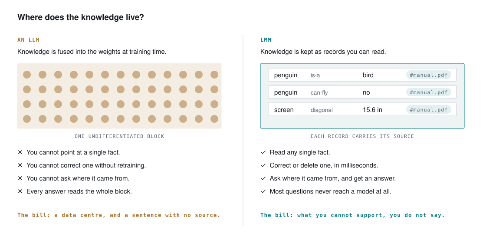

# Why a memory, not a bigger model

Language got solved. It got solved in a way that needs a data centre — and
the question this project asks is whether it had to.

## Two bills, one cause

An LLM fuses its knowledge into its weights at training time. That single
decision writes two bills:

**The bandwidth bill.** To write one word, the machine must read every
weight — billions of parameters moved from memory, per token. That is why it
needs the data centre: not the thinking, the *moving*.

**The fabrication bill.** The weights keep no record of *where* anything came
from, so the model cannot tell a memory from a guess — and neither can you.
A fluent sentence with nothing behind it costs the same as a true one.

## The other axis



LMM keeps the knowledge **outside the model**, as records you can read:

```text
subject      predicate    value      source          trust   time
penguin      is-a         bird       #manual.pdf     0.60    2026-09-05
penguin      can-fly      no         #manual.pdf     0.60    2026-09-05
```

- You can point at a single fact, correct it, delete it — in milliseconds,
  with no retraining.
- Every record carries its source and a trust level; a derived fact sits
  **below the speaking threshold** on purpose — the system may reason with
  it, and may not assert it on its own.
- Most of the machinery — storing, deriving, counting, verifying — is plain
  Python over a dict. No GPU, no network, no key.

The engine stays small and does its one job: **phrasing**. It never decides
what may be said; the gate does. A weaker engine costs you fluency, never
provenance.

## What that buys, concretely

!!! measured "Measured"
    Across every benchmark run published by this project — two languages,
    four corpora, three repeats each — the count of wrong facts asserted
    is **zero**. Not low: zero. The gate is structural, not a prompt.

- **"I don't know" you can trust.** Refusal is structural: when the memory
  holds nothing on a question, there is nothing the answer path can say.
  Measured across every benchmark run: zero wrong facts asserted.
- **Answers with receipts.** Every claim traces to a document, and in
  multi-document stores the answer names *which* document.
- **Reading is nearly free.** A document is read once, verbatim, with no
  summarisation at write time — so nothing is lost before anyone asks. The
  competitor's indexer spends hundreds of model calls summarising; a summary
  abstracts the specific value away, and the specific value is usually the
  answer.
