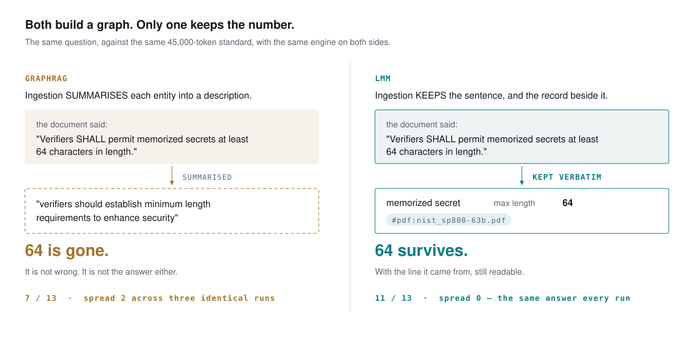

# Measurements

Every figure below is the median of three repeats, produced by the same
side-blind scorer, on the same engine for both sides. The corpora, the
questions, every answer and every scoring decision are in the repository —
re-run them, and if you find a scoring bug, open an issue: two have been
found so far, and both were penalising the competitor.

## Against GraphRAG

| same engine (gpt-4o-mini), 3 samples each | LMM | GraphRAG |
|---|---|---|
| Fictional corpus, 17 q | **17/17** · spread 0 | 16/17 · spread 0 |
| NIST SP 800-63B (45k tokens), 13 q | **11/13** · spread 0 | 7/13 · spread **2** |

*GraphRAG loses specific values.* Its indexer summarises entity
descriptions, and a summary abstracts the number away — asked for a maximum
length the standard states as **64**, it answered "verifiers should
establish minimum length requirements", a sentence in which the value never
appears. *LMM's misses are refusals* — reworded questions whose answer was
in the document and not retrieved. One failure mode approximates; the other
declines. They are not the same failure.

## Cost

| NIST SP 800-63B | LMM | GraphRAG |
|---|---|---|
| Indexing | **0 model calls** | 220 calls · 498,230 prompt tokens |
| Per question | ~5 calls | 2 calls · ~10,100 prompt tokens |

Ingestion is the structural difference: LMM reads the document verbatim and
decides nothing at write time, so reading is nearly free and nothing is
lost before anyone asks.

## Language independence

The same fictional world, line for line, in three languages — same
questions, same gold keys, same invented names:

| | median of 3 | samples |
|---|---|---|
| Turkish | **17/17** | 17 · 17 · 17 |
| English | **16/17** | 15 · 16 · 16 |
| Spanish | **15/17** | 15 · 15 · 15 |

## The scorer's own bugs

A benchmark whose author only ever finds errors that flatter him is not
evidence. Two defects were found in this project's scorer, both moving
points **away** from the competitor; both fixes were published with the
corrected numbers:

1. Abstention detection was a Turkish-only phrase list; GraphRAG's four
   correct English refusals scored as fabrications. Fix: 13/17 → 16/17.
2. The fabricated-value check read the question's own echoed subject as an
   invented designation, scoring an honest refusal as a fabrication.
