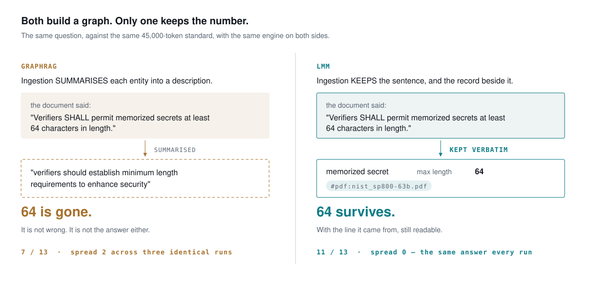

# Measurements

Every figure below is the median of three repeats, produced by the same
side-blind scorer, on the same engine for both sides. The corpora, the
questions, every answer and every scoring decision are in the repository —
re-run them, and if you find a scoring bug, open an issue: two have been
found so far, and both were penalising the competitor.

## Retrieval, 0.6

Measured on this repository's own field corpus, engine-free. A known-item
query is a line from the store with its most distinctive terms removed, so
the words alone cannot find it — the protocol needs no hand-written gold and
cannot be tuned to.

**Which encoder** — 20,000 lines, 180 queries, two terms removed:

| encoder | first hit | MRR | index build |
|---|---|---|---|
| a distillation of our own | 27% | 0.306 | 1.2 s |
| `paraphrase-multilingual-MiniLM-L12-v2` (torch) | 66% | 0.710 | 36.1 s |
| **the bundled static matrix** | **84%** | **0.883** | **0.3 s** |

**Which layer** — 103 documents, the store's own `find`:

| | first-3 hit |
|---|---|
| words alone | 92% |
| + meaning at the DOCUMENT layer | **99%** |
| + meaning at the LINE layer | no change |
| lines chosen by meaning INSIDE a document | 78% → **31%** |

**End to end** — 115,913 lines, 304 queries, by whether the ANSWERING line
reaches the five the engine is shown:

| | first | in five |
|---|---|---|
| words alone | 31% | 32% |
| + meaning channel | 31% | 60% |
| + late-interaction reordering | 34% | **79%** |

**How much reordering is worth, by how vague the question is** — the same
corpus, by terms removed from the query:

| terms removed | single vector | late interaction |
|---|---|---|
| 2 | 0.864 | 0.884 |
| 4 | 0.779 | 0.825 |
| 6 | 0.707 | **0.807** |

## Cost retractions, 0.6

Three hedges against weak retrieval were re-measured after it improved, and
each had stopped earning. Eleven field questions with gold answers:

| hedge | measurement | now |
|---|---|---|
| 3 candidate subsets per question | every admitted answer came from the WIDE block; the narrow ones won nothing | `CANDIDATES = 1` — 139 → 104 calls, 4/11 → 5/11 |
| 2 views per judge | the second view confirmed nothing, on either judge | `VIEWS = 1` — 8 fewer calls in 104 |
| the offline expansion index | kept zero of a hand-written perfect query set | deleted, −607 lines |

| | |
|---|---|
| first question on a 115k-line store | 10.6 s → **0.13 s** (the derived index is saved) |
| a deterministic question asked twice in one turn | asked once — one refusal turn, −2 calls, −11k tokens |

## Against GraphRAG

| same engine (gpt-4o-mini), 3 samples each | LMM | GraphRAG |
|---|---|---|
| Fictional corpus, 17 q | **17/17** · spread 0 | 16/17 · spread 0 |
| NIST SP 800-63B (45k tokens), 13 q | **11/13** · spread 0 | 7/13 · spread **2** |

*GraphRAG loses specific values.* Its indexer summarises entity
descriptions, and a summary abstracts the number away — asked for a maximum
length the standard states as **64**, it answered "verifiers should
establish minimum length requirements", a sentence in which the value never
appears. *LMM's misses are refusals* — reworded questions whose answer was
in the document and not retrieved. One failure mode approximates; the other
declines. They are not the same failure.

## Cost

| NIST SP 800-63B | LMM | GraphRAG |
|---|---|---|
| Indexing | **0 model calls** | 220 calls · 498,230 prompt tokens |
| Per question | ~5 calls | 2 calls · ~10,100 prompt tokens |

Ingestion is the structural difference: LMM reads the document verbatim and
decides nothing at write time, so reading is nearly free and nothing is
lost before anyone asks.

## Language independence

The same fictional world, line for line, in three languages — same
questions, same gold keys, same invented names:

| | median of 3 | samples |
|---|---|---|
| Turkish | **17/17** | 17 · 17 · 17 |
| English | **16/17** | 15 · 16 · 16 |
| Spanish | **15/17** | 15 · 15 · 15 |

## What the gate is actually for — a correction from the field

An integration measuring 44 supplier/requirement cells against two real
tender documents published a correction to its own earlier report, and it
corrects ours too. Its first comparison put the whole document in the
prompt — **no retrieval at all** — and the gate looked like it was buying
two fewer fabrications. That was the wrong control.

The right one is the same retrieval LMM uses (`evidence.find`, zero model
calls) with a single engine call after it instead of the gate. Same engine,
same questions, 44 cells:

| | calls | prompt tokens | seconds | false-covered |
|---|---|---|---|---|
| document in the prompt | 44 | 292,749 | 125 | 5 |
| **the same retrieval, one call, no gate** | 44 | **28,083** | **88** | **3** |
| LMM | 378 | 313,173 | 491 | **2** |

Read that column in two steps. Giving the model six retrieved lines instead
of the whole document removes two invented coverages; **adding the gate on
top of those same lines removes one more** — inside a run-to-run variance
the reporter measured at about two cells. So on that corpus the gate's
contribution to non-fabrication sits at the noise floor, for a reason worth
stating plainly: **once retrieval is good, the fabrication the gate exists
to stop was mostly not happening.** Naive RAG over the same retriever was
11× cheaper in tokens and 5.6× faster.

What the same run shows the gate DOES buy is something neither side had
measured. Counting what each approach was willing to say across the 44
cells:

| | "partly" | "fully" | "not covered" |
|---|---|---|---|
| same retrieval, no gate | **31** | 7 | 6 |
| document in the prompt | 14 | 29 | **0** |
| LMM | 0 | 34 | 10 |

Unverified answering **hedges**: 31 of 44 cells came back "partly covered",
and the whole-document variant did not once say "not covered" in 44 tries.
LMM commits — 34 to 10, and 8 of those 10 refusals are correct. A matrix
where 31 rows of 44 say "partly" tells its reader nothing.

That is the property verification sells, and it is not accuracy: **the
answers do not drift to the middle.** A system that never commits is never
wrong and never useful. The shape of the number, for anyone repeating this:
over a fixed question set, how often does the system return the
non-committal option. It costs nothing to compute and separates verified
from unverified answering far more sharply than accuracy does.

The same run also reports **zero fabrications in 44 cells** — the promise
held exactly as written. Both of LMM's false-covered cells were checked
against the document by hand: one was the abstention-stamp defect, closed
in 0.8.0 (a refusal published with `abstained=False`), and the other is a
true, sourced sentence answering a *different* question than the one asked.
Which points at the limit that actually bites, below.

## The conversation surface

Every other number on this page is document question-answering. The half
this project's name promises had no current figure at all — the last one
was twelve releases old — so `benchmarks/chat` now carries a **synthetic**
four-session conversation and fifteen labelled questions. It is small and
it is invented; it is not a substitute for LongMemEval and it is not
evidence about anyone's real corpus. What it does is exercise the classes
recorded as open.

**13–14/15** asking each question independently — the aggregate moves by
one cell between runs, which is the variance to expect at this size:

| class | score | what it asks |
|---|---|---|
| facts | **6/6** | including a fact the speaker later supersedes |
| traps | **3/3** | things the conversation never mentions — no fabrication |
| paraphrase | **4/4** | the discriminating word never written in the store |
| composition | **2/2** | a quantity that must be summed across two sessions |

Read the cell, not the total. 0.12.0's recency vote was built to move one
of these, and the evidence for it is that cell repeated rather than the
aggregate: asked *"who does the user report to?"* the memory answers the
**current** manager 3 times out of 3 with the vote, and the one replaced
three months earlier 3 times out of 3 without it. Composition closed in 0.12.1: asked for a total whose two parts are
stated in two different sessions, the memory answers **"5 (Foundation
training course: 2 + Advanced training course: 3)"** — the total with its
addends, by its own arithmetic over amounts each verified against a
stored line. It had been abstaining because the engine echoed a
placeholder out of the instruction and every pair died in verification,
silently.

**Summing written-out numbers is not supported and will not be.** An
amount lives only if its value is written digit for digit on a line the
store holds; reading "two" as 2 would need a numeral list per language,
which this project forbids itself.

Asked as **one running session** rather than independently, the score is
13/15: the consultation's accumulated terms ride the query and the
current line is not retrieved at all, which no reordering can reach.
A batch of independent questions wants `standalone=True`.

!!! warning "A run in the same process is not a run"
    This harness reports a median across runs and a **flip count**, and
    it was measured giving both for free: with `--runs 3` the second and
    third runs took **zero seconds** and agreed with the first on every
    question, because the engine pools its deterministic calls for the
    life of the process. Three runs in one process are one run reported
    three times. Each run now gets a fresh interpreter. Any flip count
    published before 0.11.0 was read from one run.

## 0.13.0 — length, shapes and derived arithmetic

**Length is no longer free.** The lexical score added one weight per
matched word and nothing charged a line for its size, so a long window
touched more of the question for being long. BM25's length normalisation
(`b = 0.20`) now divides it. Measured without any engine, over six seats:

| `b` | LongMemEval (30 q): characters | answer in block | NIST SP 800-63B (11 q): characters | answer in block |
|---|---|---|---|---|
| 0.00 | 4,972 | 10/30 | 1,874 | 9/11 |
| **0.20** | **1,765** | **10/30** | **1,330** | **9/11** |
| 0.75 | 659 | 9/30 | 1,116 | 9/11 |

The block keeps its seats; what leaves is length, not evidence. 0.20 is
the largest value at which every invariant still holds.

**A difference is composed, not guessed.** The plan organ gained `amount`,
`minus`, `ratio` and `per`, and the shape reader gained `derive` and
`span`. Without them, "how much more did I raise than my goal" was filed
under `sum`, and the summing organ answered `850 (450 + 400)` to a question
whose answer is 50. Now: `50 — charity cycle ride raised (450), my initial
goal (400).`

**LongMemEval, thirty questions, `quoted=True`, shape read:**

| | 0.12.1 (`shape="ask"` declared) | 0.13.0 (shape read) |
|---|---|---|
| correct | 7/30 | **13/30** |
| answered, and wrong | 6 | 4 |
| engine calls | 248 | 248 |

Thirty of five hundred questions, judged by the configured engine
(`gpt-4o-mini`, the model that answered): a comparison between this
project's own versions, not with published leaderboards. Per-question
files, named by commit, are in `benchmarks/longmemeval_runs/`.

## Where a question's calls actually go — October 2026

The cost table on this page predates the shapes and the organs, and so did
the cost harness's own list of headings: every call the router and the
organs made filed under `other` until 5 October 2026, by which time that
heading held the largest number in the system. A heading that holds the
biggest number is not a heading.

Re-measured on NIST SP 800-63B, 13 questions, a fresh process per arm
(`benchmarks/gate_arms.py`, per-question results beside it):

| bucket | calls | |
|---|---|---|
| routing | 21 | which shape, which language, which two things |
| answer | 19 | |
| extract | 13 | |
| relation-check | 12 | the classifier readings |
| organ | 8 | |
| judge | 6 | |
| read-back | 3 | the exit gate's second reading |
| widen | 1 | |
| | **83** | 6.4 a question |

Two readings matter more than the total. **Routing is the largest cost a
question carries**, and routing with extraction is 41% of it — spent
before any answer exists. And **the read-back is three calls of
eighty-three**: the check most often asked about barely runs, because the
two-tier gate admits a fully covered answer without asking the engine.

### Declaring what the caller knows

`standalone=` and `shape=` have shipped since 0.9.1 and 0.13.0. Same
thirteen questions, one run each:

| configuration | correct | calls | a question |
|---|---|---|---|
| as shipped | 9 / 13 | 83 | 6.4 |
| `standalone=True` | 9 / 13 | 76 | 5.8 |
| `ENOUGH` on | 10 / 13 | 84 | 6.5 |
| `standalone=True, shape="material"` | 10 / 13 | **43** | **3.3** |

No gate was traded for it: `read-back` is 3 in both arms, so the exit gate
ran exactly as often. What fell to zero was the classifier bucket, not the
relation gate. The extra correct answer is **not** claimed — the same arm
has measured 9 and 10 on separate runs. What is claimed is that nothing
was lost for half the calls.

### Two levers measured and left off

**`ENOUGH`** asks the evidence whether it holds an answer before one is
written. On these questions it declined four — the two traps, the metadata
question and one paraphrase — and all four were right, with none of the
nine answerable questions wrongly stopped. It saved nothing: 84 calls
against 83, because a refusing turn has already paid its routing and its
extraction before the verdict is reached. A right decision taken late is
paid for twice. The switch ships off.

**`WIDEN`**, the widened second retrieval, was measured where it is
supposed to help: a document that answers "what is the shortest password"
under *memorized secret*. Retrieval recall before and after, 11 calls, no
answering noise (`benchmarks/widen_recall.py`): **rescued 0, broken 0,
8/11 either way**. The reason is structural — `generate.phrasings` is
shown the QUESTION and never the store, so it proposes only words the
question already used. The document's own words are in the index
("memorized" on 1,173 lines, "director" on 24); they are never proposed.
The vocabulary gap is a measured, open limit, and the widening as built
does not close it.

## The scorer's own bugs

A benchmark whose author only ever finds errors that flatter him is not
evidence. Three defects have been found in this project's scorers. The
first two moved points **away** from the competitor; the third moved
points **toward** this project. All three fixes were published with the
corrected numbers:

1. Abstention detection was a Turkish-only phrase list; GraphRAG's four
   correct English refusals scored as fabrications. Fix: 13/17 → 16/17.
2. The fabricated-value check read the question's own echoed subject as an
   invented designation, scoring an honest refusal as a fabrication.
3. The LongMemEval harness searched the whole reply for the gold string,
   including the reply's own source stamp. Asked how many doctor's
   appointments in March, the memory answered "3: Dr. Johnson, Dr. Smith,
   Dr. Thompson." and the gold "2" was found in the stamp's `2023`. The
   engine judge had rejected it. Every cell measured over several days was
   one question too high and one wrong answer too low; the harness now
   reads the reply before its source mark, and the corrected figures are
   the ones above.
